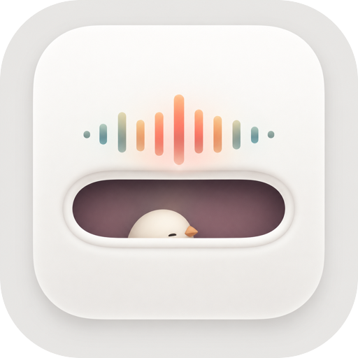

<div align="center">
  

  # Perch

  A Dynamic Island-style live hub for macOS, living at the top center of your screen.

  [](https://www.apple.com/macos/)
  [](https://swift.org)
  [](LICENSE)
</div>

---

Perch is a macOS menu bar app that places a persistent pill-shaped island at the top center of your screen. On MacBooks with a physical notch, it integrates naturally into the notch area. On non-notch Macs, it floats as a standalone Dynamic Island–style pill.

Hover or click to expand. Get at-a-glance information on your AI usage, what's playing, and upcoming developer features — all without leaving your current app.

> [!NOTE]
> Perch is not distributed via the Mac App Store. It uses window level APIs and authentication methods incompatible with the sandbox. Distribution is via GitHub Releases and Homebrew Cask.

## Installation

> [!WARNING]
> Perch is currently in beta and not yet publicly available for download. The options below will be enabled at v1.0 release.

**Homebrew Cask** (coming at v1.0):
```bash
brew tap tukuyomil032/tap
brew install --cask perch
```

**GitHub Releases** (coming soon): Download the signed `.dmg` from the [Releases](https://github.com/tukuyomi032/perch/releases) page and drag Perch.app to your Applications folder.

Once installed, Perch launches at login and appears as a pill at the top center of your screen. No further configuration is required to get started.

## Features

### Core Island UI
- Pill-shaped overlay window positioned relative to the physical notch (or floating on non-notch screens)
- Hover to expand, auto-collapse on mouse leave
- Metal SDF metaball animation during transitions
- Menu bar icon, login item support

### Now Playing
- Detects playback from **Spotify**, **Apple Music**, and **YouTube Music**
- Album artwork, playback controls (play/pause, skip)
- Lyrics display via [LRCLIB](https://lrclib.net)
- Audio waveform visualizer

### AI Usage Tracking
- Tracks usage for **Claude**, **Codex**, **OpenAI**, and **OpenRouter**
- Displays remaining quota, cost estimate, and reset countdown
- Per-provider cards in the expanded island view

## Widget Preset System

Perch's tabs are not feature switches — they are user-defined **widget layout presets**. New features are implemented as widgets conforming to `PerchWidget` and registered at launch:

```swift
nonisolated struct MyWidget: PerchWidget {
    let id = "myWidget"
    let supportedSizes: Set<WidgetSize> = [.compact, .standard]
    func body(size: WidgetSize) -> AnyView { ... }
}

// In AppDelegate:
appState.widgetRegistry.register(MyWidget())
```

The preset and widget infrastructure (`PresetStore`, `WidgetRegistry`, `WidgetLayout`, `WidgetProtocol`) is stable and must not be modified without understanding the full system.

## Requirements

| Requirement | Version |
|---|---|
| macOS | 15 Sequoia or later |
| Xcode | 16 or later |
| Swift | 6 |
| Architecture | Apple Silicon, Intel |

## Getting Started

**Clone and open in Xcode:**
```bash
git clone https://github.com/tukuyomi032/perch.git
open perch.xcodeproj
```

**Build from the command line:**
```bash
xcodebuild -scheme perch -configuration Debug build
```

**Using `just` (requires `brew install just xcbeautify`):**
```bash
just build   # Debug build
just test    # Run unit tests
just format  # Format Swift source files
```

> [!TIP]
> Run `just setup` to verify dev tools are installed and configure Git hooks via Lefthook.

## Architecture

```
UI Layer (SwiftUI)
  ├─ CompactPillView      — pill UI, hover trigger
  ├─ ExpandedIslandView   — full card layout
  ├─ DesignSystem         — design tokens (grid, radius, animation curves)
  └─ SettingsView         — preferences UI

Core Layer
  ├─ AppState             — @Observable global state
  ├─ EventBus             — decoupled event propagation
  ├─ PresetStore          — widget preset CRUD + persistence
  ├─ WidgetRegistry       — widget registration and lookup
  └─ RefreshScheduler     — actor-based periodic update loop

Integration Layer (AppKit)
  ├─ IslandWindow         — transparent NSWindow overlay
  ├─ NotchDetector        — detects notch presence and dimensions
  ├─ IslandGeometry       — frame calculation per screen/mode
  └─ MouseEventMonitor    — hover and click detection
```

AppKit handles all window management. SwiftUI handles all visible content. They are bridged via `NSHostingController`.

## Dependencies

| Package | Version | Purpose |
|---|---|---|
| [BigInt](https://github.com/attaswift/BigInt) | 5.7.0 | Arbitrary-precision integer arithmetic |
| [CryptoSwift](https://github.com/krzyzanowskim/CryptoSwift) | 1.10.0 | Cryptographic functions |
| [Defaults](https://github.com/sindresorhus/Defaults) | 9.0.6 | Type-safe `UserDefaults` persistence |
| [FrameworkToolbox](https://github.com/Mx-Iris/FrameworkToolbox) | 0.7.1 | AppKit/Cocoa framework utilities |
| [KeyboardShortcuts](https://github.com/sindresorhus/KeyboardShortcuts) | 2.4.0 | Global keyboard shortcut registration |
| [LyricsKit](https://github.com/MxIris-LyricsX-Project/LyricsKit) | 1.9.0 | Lyrics fetching and parsing |
| [mediaremote-adapter](https://github.com/ejbills/mediaremote-adapter) | master | MediaRemote framework bridge |
| [Regex](https://github.com/ddddxxx/Regex) | 1.0.1 | Regular expression matching |
| [swift-async-algorithms](https://github.com/apple/swift-async-algorithms) | 1.1.4 | Async sequence algorithms |
| [swift-collections](https://github.com/apple/swift-collections) | 1.5.1 | Efficient data structures |
| [swift-log](https://github.com/apple/swift-log) | 1.13.1 | Structured logging |
| [swift-syntax](https://github.com/swiftlang/swift-syntax) | 602.0.0 | Swift parser and syntax utilities |
| [SwiftCF](https://github.com/MxIris-Library-Forks/SwiftCF) | 0.2.2 | CoreFoundation Swift wrappers |
| [Sparkle](https://github.com/sparkle-project/Sparkle) | 2.9.1+ | Over-the-air updates (Phase 6) |

## Roadmap

| Phase | Version | Scope | Status |
|---|---|---|---|
| 0 | — | Project scaffolding | ✅ |
| 1 | v0.1 | Core Island UI | ✅ |
| 2 | v0.2 | Now Playing | ✅ |
| 3 | v0.3 | AI Usage tracking | ✅ |
| 3.5 | — | Visual polish, Now Playing fixes | 🚧 In progress |
| 4 | v0.4 | File Shelf (drag & drop, Quick Look, AirDrop) | Planned |
| 5 | v0.5 | Dev Status (GitHub Actions, CI notifications) | Planned |
| 6 | v1.0 | Sparkle, Homebrew Cask, stabilization | Planned |

## For Contributors

### Project layout

```
perch/
  App/          — entry point, AppDelegate, MenuBarController
  Core/         — AppState, EventBus, Preferences, WidgetRegistry
  Island/       — IslandWindow, NotchDetector, IslandGeometry, MouseEventMonitor
  UI/           — SwiftUI views and DesignSystem
  Features/     — NowPlaying, AIUsage (self-contained feature modules)
  Providers/    — Claude, Codex, OpenAI, OpenRouter
  Resources/    — Assets, Info.plist, Entitlements, Localizations
perchTests/     — Unit tests
docs/           — Design references, progress log, specs
```

### Coding conventions

- `@MainActor` on all UI-touching classes (`AppState`, view models, controllers)
- `@Observable` for state management — avoid `ObservableObject`/`@Published`
- `actor` for concurrent services (e.g. `RefreshScheduler`)
- AppKit for window control; SwiftUI for display content

### Design system

`DesignSystem.swift` is the single source of truth for visual constants:

| Token | Value |
|---|---|
| Grid unit | 4pt |
| Pill corner radius | 17pt (continuous) |
| Card corner radius | 28pt (continuous) |
| Typography | SF Pro / SF Mono (system fonts only) |
| Background material | `NSVisualEffectView` `.ultraDark` vibrancy |

> [!NOTE]
> Perch follows [hallmark](https://github.com/nutlope/hallmark) anti-AI-slop design rules. Avoid generic LLM-flavored UI. When in doubt, reference macOS HIG and the existing `DesignSystem`.

### Inspired by

- [Boring Notch](https://github.com/TheBoredTeam/boring.notch) — Dynamic Island UI, Now Playing patterns
- [NotchDrop](https://github.com/Lakr233/NotchDrop) — transparent window control, notch detection
- [CodexBar](https://github.com/steipete/CodexBar) — AI usage monitoring, provider separation design
